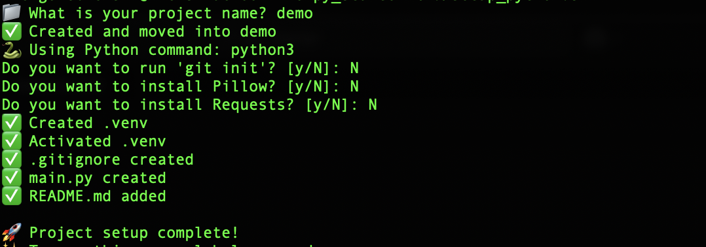

# Py Starter
Author: Nick Golebiewski
*Sometimes it is a drag to have to set up a virtual environment for Python, why not just do it in one line with a few extras?*


## Bash script to do that repetetive Python start up. 
- Create and activate virtual environment
- Make a .gitignore
- Optionally git init AND install Pillow and Requests (My two most used libraries)
- Follow the instructions to set up the script globally, so all you have to do is type `setup_python` and all this stuff will be done like magic.

- `chmod +x setup_python.sh` to make the script executable.
- Run `./setup_python.sh` add `-y` flag for defaults.
  - DEFAULT: no git, no Pillow, no Requests with `./setup_python.sh -y`


## 📄 How to Use This Script Globally

1. Save this script as `setup_python` (no file extension)
2. Move it to a directory in your PATH (e.g., `/usr/local/bin` or `~/bin`)
   ```bash
   sudo mv setup_python /usr/local/bin/
   ```
3. Note that you'll be prompted to enter your password 
4. Make it executable:
   ```bash
   chmod +x /usr/local/bin/setup_python
   ```

Now you can run `setup_python` from anywhere in your terminal! 🚀

